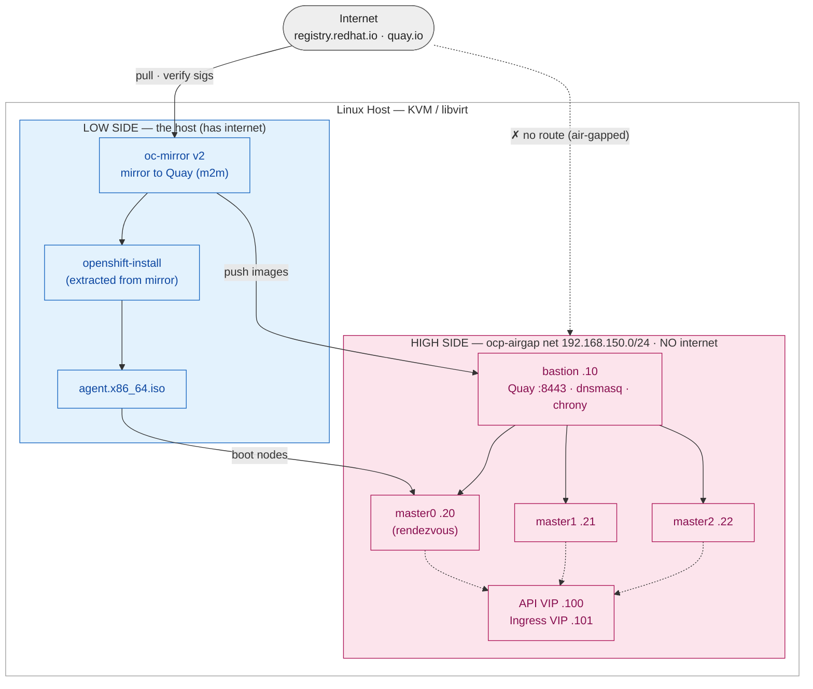

# Air-Gapped OpenShift Lab

Automated build of a fully **disconnected** OpenShift **compact 3-node** cluster in a
KVM/libvirt home lab on a single Linux host. Reproduces the pattern used to deploy OpenShift
into a Defence enclave: a local mirror registry, `oc-mirror v2`, and the **Agent-based
Installer** — with no internet access to the cluster.

Two Ansible playbooks do everything:

| Playbook | Purpose |
|----------|---------|
| `bootstrap-openshift-lab.yml` | Build the whole lab end to end |
| `teardown-openshift-lab.yml`  | Remove it cleanly |

---

## Architecture



- **Host = low side.** Has internet. Mirrors the OCP release into Quay and builds the agent ISO.
- **`ocp-airgap` = high side.** An **isolated** libvirt network (no `<forward>`, so no route out). The bastion serves the registry, DNS, and time; the three control-plane nodes pull everything from the bastion and never touch the internet.
- Content only ever flows **low → high** — the same discipline a real enclave enforces with a data diode or cross-domain solution.

---

## What it builds

- **1 × bastion** (Rocky 9 cloud image): `mirror-registry` (Quay) on `:8443`, `dnsmasq`, `chrony`.
- **3 × control-plane nodes** (RHCOS, compact — masters schedulable), self-hosted API/Ingress VIPs.
- Cluster `compact.lab.example.com`, OpenShift pinned to `ocp_release` (default `4.19.9`).

## Prerequisites

1. Linux host with CPU virtualization (VT-x/AMD-V), **~100 GB RAM**, **~700 GB free disk**.
2. `ansible-core` (no extra collections needed):
   ```bash
   sudo dnf install -y ansible-core
   ```
3. A Red Hat pull secret at `~/pull-secret.json`
   (from <https://console.redhat.com/openshift/install/pull-secret>).
4. Confirm the pinned version exists before running:
   ```bash
   curl -s https://mirror.openshift.com/pub/openshift-v4/x86_64/clients/ocp/ \
     | grep -oE '4\.19\.[0-9]+' | sort -uV | tail
   ```

## Usage

```bash
# build (≈60–90 min: ~30 GB mirror + 40–60 min cluster install)
ansible-playbook bootstrap-openshift-lab.yml --ask-become-pass

# tear down
ansible-playbook teardown-openshift-lab.yml --ask-become-pass
#   keep tooling/workdir:  -e remove_binaries=false -e remove_workdir=false
```

Re-runs are safe — completed steps are guarded and skipped, so a failed run resumes forward.

## Key variables (top of the bootstrap playbook)

| Variable | Default | Notes |
|----------|---------|-------|
| `ocp_release` | `4.19.9` | **Confirm it exists** on the mirror |
| `quay_password` | `ChangeMe123!` | **change this** |
| `detach_bastion_nat` | `false` | `true` = cut bastion internet after build (air-gap fidelity) |
| `create_dev_user` | `true` | adds an htpasswd `developer` / `DevPassw0rd!` |
| network / IPs | `192.168.150.0/24` | bastion `.10`, nodes `.20–.22`, VIPs `.100/.101` |

## Access

```bash
export KUBECONFIG=~/ocp-lab/cluster/auth/kubeconfig
oc get nodes
```

- **Console:** `https://console-openshift-console.apps.compact.lab.example.com`
- **kubeadmin password:** `~/ocp-lab/cluster/auth/kubeadmin-password`
- **developer:** `developer` / `DevPassw0rd!`
- **Quay:** `https://bastion.lab.example.com:8443` (`admin` / `ChangeMe123!`)

## Fixes baked in

Everything below is handled automatically (each one is a real trap when done by hand):

- **virtio NICs** → node interface is `enp1s0`, matching the agent-config nmstate.
- **disk `boot.order=1` / cdrom `boot.order=2`** → boots the ISO while the disk is empty, then boots from disk after install (no boot loop, no power-cycling).
- **`openshift-install` extracted from the mirror** (`--idms-file`) → version match; no `manifest unknown`.
- **Quay CA taken from the live endpoint** → correct signer in `additionalTrustBundle`; no x509 errors.
- **dnsmasq on all interfaces + firewall 53/8443/ntp** → nodes resolve and reach the registry.
- **chrony `local stratum 10` + `additionalNTPSources`** → the NTP validation passes offline.

## Notes & caveats

- **Bastion distro:** Rocky 9 cloud image (fully scriptable). Swap `bastion_image_url` for a RHEL guest image if you want production fidelity (needs your subscription).
- **Mirroring:** done host→Quay directly (`m2m`) for simplicity. A true air-gapped deployment uses `m2d` → media/diode → `d2m`.
- **`/etc/hosts` immutable?** If the host has `chattr +i /etc/hosts`, clear it first: `sudo chattr -i /etc/hosts`.
- **Cert expiry:** the cluster's install-time certs rotate only while running. After install, let it run a day (or snapshot the VMs) before shutting down, or nodes come back `NotReady` — see the certificates deep-dive doc.

## Companion docs

- Disconnected OpenShift lab guide (step-by-step, manual)
- Air-gapped systems in a Defence context (architecture & governance)
- Supply-chain trust & PKI deep dive
- Certificates & CAs in air-gapped clusters
